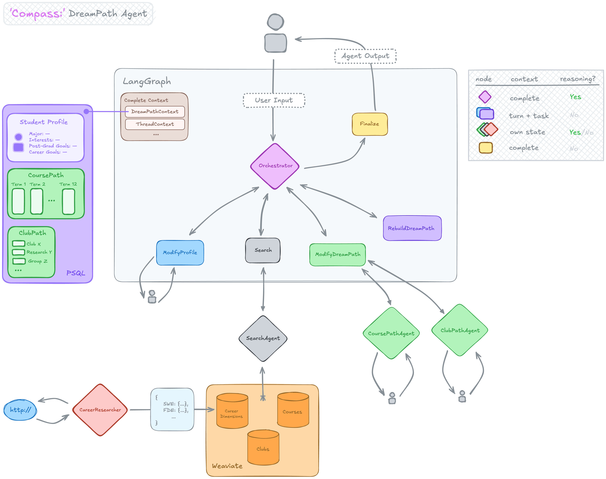

# DreamPath

An AI platform that equips students with the tools to achieve their goals and maximize career readiness by making the most of the college experience.

Outfitted with an agentic system that generates personalized, dynamic recommendations **grounded in career success signals** and **real time data**, DreamPath guides students across 2 core college pillars:

1. **Courses** — the courses you take, within and outside of your major
2. **Clubs** — your on-campus extracurricular activities

## Architecture

DreamPath makes use of *Compass*, an agentic advising system to provide a means of long-term communication with students to factor in changes to their interests, goals, and lives and make dynamic, adaptive recommendations for their bast path forward.

Compass takes action via tools (e.g, hybrid search, modifying students' profiles, building a modification plan, executing a full-scale upheaval of recommendations for things like career pivots) and sub-agents (e.g., for search and executing CoursePath modifications). Tool and agent execution / results, student data, and running summaries are dynamically engineered into agent nodes' context for greater awareness of relevant information and efficiency. Sub-agents additionally help abstract away low-level operations and minimize unnecessary rot for Compass' orchestrator.

> *Stateless system implemented in LangGraph with custom context handling and hybrid vector search in Weaviate.*



## Infrastructure / Stack

### Backend
- **Framework**: FastAPI
- **Agent Orchestration**: LangGraph (custom node-based orchestration with handoff routing)
- **(Current) LLM Providers**: OpenAI, Anthropic
- **Vector Database**: Weaviate v4 (hybrid search with BM25 + embeddings)
- **Database**: PostgreSQL (Supabase transaction pooler)

> *Both service and Weaviate DB hosted in Fly.io, with PSQL DB in Supabase*

### Frontend 
- **Framework**: React + Vite
- **State Management**: React Query + Context API
- **Authentication**: JWT-based Supabase Auth
- **API Client**: Axios w/ streaming support

> *Hosted on Vercel*


## Project Structure

```
backend/
├── agents/                    # Agent service toolkit integration
├── dreampath_processing/      # Core DreamPath logic
│   ├── dreampath_agent/       # Main agent (stateless orchestrator)
│   │   └── search_agent/      # Course search sub-agent
│   ├── courses/               # Course path building & scheduling
│   │   └── coursepath_agent/  # Course path sub-agent
│   ├── database/              # PostgreSQL services & schema
│   └── modules/               # Student profiles, shared logic
├── service/                   # FastAPI service layer
└── memory/                    # LangGraph checkpointing (PostgreSQL)

frontend/
├── src/
│   ├── components/            # React components (Dashboard, Courses, etc.)
│   ├── contexts/              # AuthContext (Supabase auth)
│   ├── lib/                   # API client, utilities
│   └── styles/                # CSS (base, components, course path)
```

## Development Setup

### Prerequisites

- **Python 3.12** (NOT 3.11, NOT 3.13 - LangChain has import issues with 3.13)
- **Node.js 18+** (for frontend)
- **Docker** (for local infrastructure)
- **uv** (Python package manager) - `pip install uv` or `brew install uv`
- **OpenAI API Key** (required for Weaviate embeddings)

### Quick Start

```bash
# 1. Clone and install dependencies
git clone https://github.com/kabirmoghe/dreampath.git
cd dreampath
uv sync

# 2. Create .env file with API keys and config (ask maintainer for template)

# 3. Start infrastructure (Weaviate + PostgreSQL)
docker compose up -d

# 4. Setup database schema
uv run python backend/setup_database.py

# 5. Setup Weaviate data (creates collections + ingests course/major CSVs)
uv run python backend/setup_weaviate.py

# 6. Start backend
uv run python backend/run_service.py
# API at http://localhost:8080/docs

# 7. Start frontend (new terminal)
cd frontend && npm install && npm run dev
# App at http://localhost:5173
```

See [backend/README.md](backend/README.md) for more Weaviate data details.

## Acknowledgments

This project incorporates components from the [Agent Service Toolkit](https://github.com/JoshuaC215/agent-service-toolkit) by Joshua Carroll. The toolkit provides infrastructure for productionizing LangGraph agents, including the FastAPI service layer, client SDK, and agent registry patterns.
