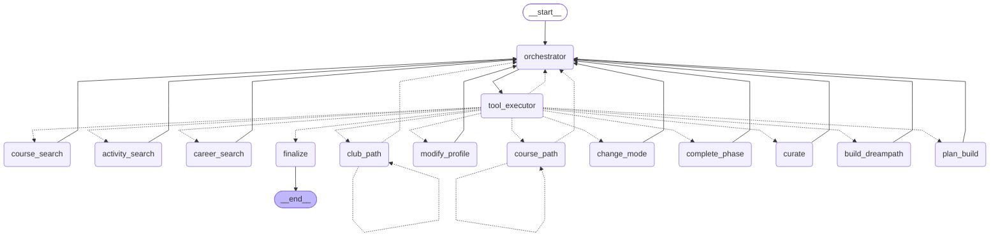

```mermaid
---
config:
  flowchart:
    curve: linear
---
graph TD;
	__start__([__start__]):::first
	orchestrator(orchestrator)
	tool_executor(tool_executor)
	course_search(course_search)
	activity_search(activity_search)
	career_search(career_search)
	course_path(course_path)
	club_path(club_path)
	modify_profile(modify_profile)
	finalize(finalize)
	change_mode(change_mode)
	complete_phase(complete_phase)
	curate(curate)
	build_dreampath(build_dreampath)
	plan_build(plan_build)
	__end__([__end__]):::last
	__start__ --> orchestrator;
	activity_search --> orchestrator;
	build_dreampath --> orchestrator;
	career_search --> orchestrator;
	change_mode --> orchestrator;
	club_path -.-> orchestrator;
	complete_phase --> orchestrator;
	course_path -.-> orchestrator;
	course_search --> orchestrator;
	curate --> orchestrator;
	modify_profile --> orchestrator;
	orchestrator --> tool_executor;
	plan_build --> orchestrator;
	tool_executor -.-> activity_search;
	tool_executor -.-> build_dreampath;
	tool_executor -.-> career_search;
	tool_executor -.-> change_mode;
	tool_executor -.-> club_path;
	tool_executor -.-> complete_phase;
	tool_executor -.-> course_path;
	tool_executor -.-> course_search;
	tool_executor -.-> curate;
	tool_executor -.-> finalize;
	tool_executor -.-> modify_profile;
	tool_executor -.-> orchestrator;
	tool_executor -.-> plan_build;
	finalize --> __end__;
	club_path -.-> club_path;
	course_path -.-> course_path;
	classDef default fill:#f2f0ff,line-height:1.2
	classDef first fill-opacity:0
	classDef last fill:#bfb6fc
```
